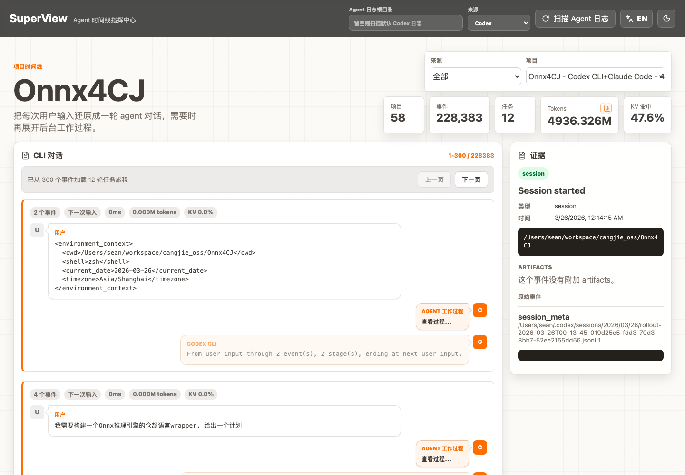

# SuperView

[English](README.md) | [简体中文](README.zh-CN.md)

SuperView 是一个本地优先的 coding agent 日志可视化仪表盘，用来理解 agent 从用户 prompt 到最终结果之间到底发生了什么。它会读取 agent 日志，重建每一轮任务旅程，并把原始 CLI session 转换成更容易阅读的对话视图：用户输入、隐藏的 agent 工作过程、最终输出、证据、token 用量和项目级遥测数据。

SuperView 的目标很直接：让一次 coding agent run 变得可检查、可回放，并且足够有视觉记忆点。

## 界面预览



## 能看到什么

- 接近 agent CLI 流程的对话 thread：`User -> agent work -> Codex/Claude/OpenCode result`。
- 类 IM 的用户与 agent 对话 bubble，长内容默认限制高度并支持展开。
- agent 的后台过程默认隐藏在 `查看过程...` 后面，主对话保持清爽，需要时再展开细节。
- evidence drawer 展示原始事件上下文、source path、line number 和 redacted payload。
- 支持按 Codex、Claude Code、OpenCode 或 all 过滤项目。
- 展示项目级 token 指标、KV cache hit rate、每轮任务运行时长和每轮 token 用量。
- Tokens 指标卡内置可展开/收起的按天 token 使用图表。
- 前景 Mario 风格 ingest loader，让扫描历史日志时页面不会像卡死。
- 在每个 agent bubble 中展示本轮用到的 skill/tool 能力标签。

## 当前范围

SuperView 当前是一个 MVP web app/dashboard，面向本地开发者使用，数据存储在本地 SQLite 数据库中。它还没有打包成 desktop app，但当前架构保留了这个方向。

已支持的日志来源：

- Codex CLI sessions
- Claude Code project JSONL logs
- OpenCode exported sessions

默认情况下，普通 ingest 只扫描 Codex 日志。Claude Code 和 OpenCode 已经支持，但需要在 UI 中选择对应来源，或者通过 ingest API 显式传入 `sources`。

## 快速开始

```bash
pnpm install
pnpm dev
```

打开应用：

```text
http://127.0.0.1:5173/
```

API 服务地址：

```text
http://127.0.0.1:5174/
```

## 导入 Agent 日志

### 通过 UI

1. 使用 `pnpm dev` 启动应用。
2. 选择日志来源：Codex、Claude Code、OpenCode 或 all。
3. 如有需要，填写自定义 agent log root。
4. 点击 `Scan Agent Logs`。
5. 等待 ingest loader 完成，然后在右上角选择项目查看。

### 通过 API

扫描默认 Codex 日志：

```bash
curl -X POST http://127.0.0.1:5174/api/ingest \
  -H 'Content-Type: application/json' \
  -d '{"sources":[{"provider":"codex"}]}'
```

从自定义 root 扫描 Claude Code 日志：

```bash
curl -X POST http://127.0.0.1:5174/api/ingest \
  -H 'Content-Type: application/json' \
  -d '{"sources":[{"provider":"claude-code","root":"/path/to/.claude"}]}'
```

扫描 OpenCode export 文件：

```bash
curl -X POST http://127.0.0.1:5174/api/ingest \
  -H 'Content-Type: application/json' \
  -d '{"sources":[{"provider":"opencode","path":"/path/to/opencode-export.json"}]}'
```

查询 ingest 状态：

```bash
curl http://127.0.0.1:5174/api/ingest/jobs/<jobId>
```

## 默认日志位置

- Codex: `$HOME/.codex/sessions/**/*.jsonl`
- Claude Code: `$HOME/.claude/projects/**/*.jsonl`
- OpenCode: `opencode session list --format json` 加 sanitized `opencode export`

## 常用脚本

```bash
pnpm dev        # 同时启动 API 和 Vite client
pnpm dev:server # 只启动 Express API
pnpm dev:client # 只启动 Vite client
pnpm build      # Typecheck 并构建 UI
pnpm preview    # 预览 production UI build
pnpm typecheck  # 运行 TypeScript 检查
pnpm test       # 运行 Vitest 测试
pnpm test:e2e   # 运行 Playwright 测试
pnpm ingest     # 运行 ingest CLI helper
```

## 架构

```text
ui/            React + Vite dashboard
runtime-node/  Express API、ingest service、worker process、log adapters
core/          Parser、normalizer、redactor、timeline、replay、shared types
storage/       SQLite database layer 和本地数据路径
tests/         Unit、integration 和 browser-facing 测试
docs/          Feature notes 和 TODO tracking
plan/          Planning artifacts 和 implementation notes
design/        HTML design previews
```

ingest 路径和 API 路径是拆开的。API 只负责创建 ingest job 并立即返回，worker process 负责扫描、解析日志文件，并把标准化后的 project/session/event 数据写入 SQLite。这样在扫描 300+ 历史 sessions 时，dashboard 仍然可以保持响应。

ingest service 还实现了 single-flight：如果已经有一个 ingest job 在运行，再次点击扫描会返回已有 job，而不是启动第二个全量扫描。

## API Reference

- `GET /api/health`
- `POST /api/ingest`
- `GET /api/ingest/jobs/:id`
- `GET /api/projects`
- `GET /api/projects/:id/timeline`
- `GET /api/projects/:id/token-usage/daily`
- `GET /api/task-journeys/:id`
- `GET /api/events/:id/evidence`
- `GET /api/runs/:id`

## 环境变量

```bash
SUPERVIEW_DATA_DIR=/path/to/data
SUPERVIEW_CODEX_HOME=/path/to/.codex
SUPERVIEW_CLAUDE_HOME=/path/to/.claude
SUPERVIEW_API_PORT=5174
```

默认值：

- `SUPERVIEW_DATA_DIR` 默认为当前工作目录下的 `.superview`。
- `SUPERVIEW_CODEX_HOME` 默认为 `$HOME/.codex`。
- `SUPERVIEW_CLAUDE_HOME` 默认为 `$HOME/.claude`。
- `SUPERVIEW_API_PORT` 默认为 `5174`。

## 隐私模型

SuperView 是 local-first 的，不需要账号、云同步或远程后端。

原始 agent 日志可能包含敏感 prompt、文件路径、tool output 和项目上下文。SuperView 会在本地存储标准化记录，并通过 UI 暴露 redacted evidence payload。Evidence 视图保留了足够用于调试的来源信息，包括 source path、line number、timestamp 和 hash metadata。

有些 reasoning content 可能显示为不可用或隐藏。这通常意味着源日志没有暴露这些内容、内容被加密，或者 agent provider 只记录了占位文本而不是明文 reasoning。

## Desktop App 方向

当前 MVP 是 web app，但整体形态已经比较适合 desktop 化：

- storage layer 已经使用本地 SQLite。
- ingest 需要访问本地文件系统，适合映射到 Electron 或 Tauri。
- UI 和 API 已拆分，后续可以把 API process 内嵌进 desktop app，也可以替换成 desktop-native bridge。
- 隐私敏感数据可以继续留在用户机器上。

desktop packaging 仍然需要单独处理文件权限、数据库位置、后台 ingest 生命周期、应用更新和 log-source discovery。

## Roadmap

- 展示每一轮 task journey 中实际传递给 agent 的 context，从用户 prompt 到最终结果完整串起来。
- 增强 context provenance，让用户看到 agent 为什么拥有或缺失某些信息。
- 改进 desktop packaging 和首次启动时的 log-source setup。
- 随着 Claude Code 和 OpenCode 日志/export 格式演化，继续增强兼容性。
- 增加跨项目、跨日期、跨 agent provider 的更深入对比。
